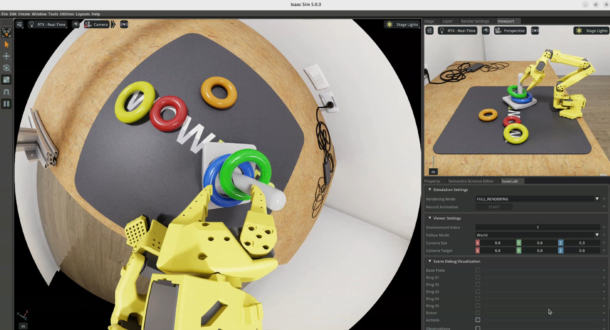

# Lerobot SO-101 Teleop Isaac Lab environment


[](https://docs.isaacsim.omniverse.nvidia.com/latest/index.html)
[](https://isaac-sim.github.io/IsaacLab/)
[](https://docs.python.org/3/whatsnew/3.11.html)




[example.webm](https://github.com/user-attachments/assets/f66d9502-2cda-4ac9-b0ff-f750d6b19e2d)

Sample Environment for the LeRobot SO-101 Robot in Isaac Lab to collect demonstrations in a simulation. This can be utilised to later procedurally scale up datasets using various methods of domain randomization and style transfer techniques ✨ 🤖


## Installation

- Install Isaac Lab by following the [installation guide](https://isaac-sim.github.io/IsaacLab/main/source/setup/installation/index.html).
 Use Conda to be synced with the Lerobot installation guide.

- In your isaac lab conda environment, Install Lerobot
    ```
    pip install 'lerobot[feetech]'
    ```
- Make sure your Lerobot _Leader_ arm has been [calibrated](https://huggingface.co/docs/lerobot/en/so101#calibrate).

- Clone this repository separately from the Isaac Lab installation (i.e. outside the `IsaacLab` directory):
    ```bash
    git clone https://gitlab-master.nvidia.com/lbenhorin/lerobot_so101_teleop.git
    git lfs pull # assets
    ```

- Using a python interpreter that has Isaac Lab installed, install the library in editable mode using:

    ```bash
    # Make sure your isaac lab + lerbot conda env is activated
    python -m pip install -e source/lerobot_so101_teleop
    ```

- Verify that the extension is correctly installed by listing the available tasks:

    ```bash
    python scripts/list_envs.py
    ```
    You should see a single environment called `Template-Lerobot-So101-Teleop-v0`
- Edit `scripts/lerobot_agent.py` by changing `SO101LeaderConfig()` to match your port and id of your setup. (You have this information from the calibration step)

- Run the environment

    ```bash
    python scripts/lerobot_agent.py --task Template-Lerobot-So101-Teleop-v0 --rendering_mode quality
    ```

## Contributors

- Thank you [LycheeAI](https://lycheeai-hub.com/) for making the SO101 arm available in USD format  💚 [https://github.com/MuammerBay/so-arm101-ros2-bridge/tree/main/IsaacSim_USD](https://github.com/MuammerBay/so-arm101-ros2-bridge/tree/main/IsaacSim_USD)

- Contributions are welcome via pull requests


## What's Next

- Add simple method to record the episodes
- Add randomization for physics materials properties in the scene
- Add randomization for visual materials properties in the scene

## Limitations

- Simulated teleoperation can be hard without VR headset.


